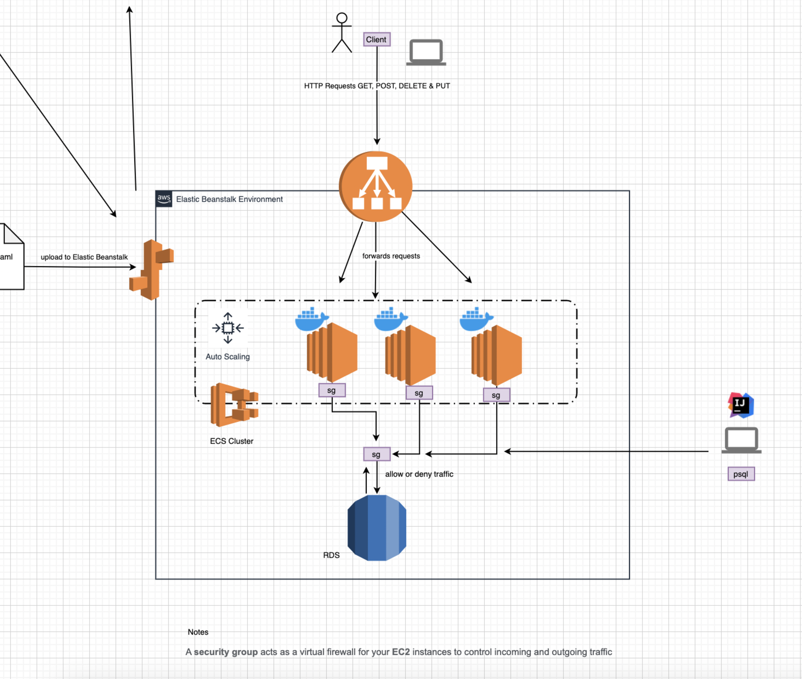

# studentSystem

### upload to Dockerhub :
``` mvn clean install -P jib-push-to-dockerhub -Dapp.image.tag= ? ```

### run psql image
``` docker run -it --rm --network=studentsystem_db-network postgres:alpine psql -h db  -U postgres ```

### structure


### RDS (Relational Database Service)

When creating a database with Elastic Beanstalk, to facilitate development, the security group's inbound rules should include the IP addresses that need access and allow the PostgreSQL protocol.

